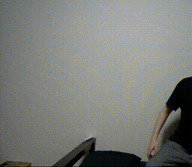
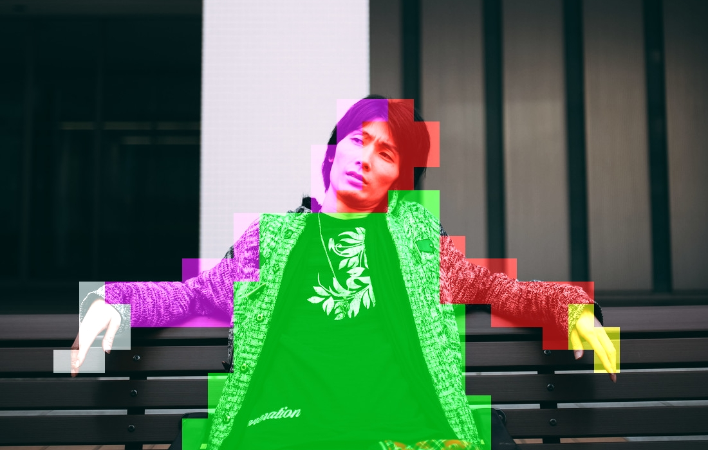

# Become Dhalsim
Stretch your arm detected by Deep Learning (BodyPix) with Edge TPU




## Environment
- Windows 10 (can be any)
- Python 3.7
- Edge TPU
- USB Camera

## How to Run
```
conda create -n py37_edgetpu_bodypix  python=3.7
conda activate py37_edgetpu_bodypix
pip install https://dl.google.com/coral/python/tflite_runtime-2.1.0-cp37-cp37m-win_amd64.whl
pip install https://dl.google.com/coral/edgetpu_api/edgetpu-2.13.0-cp37-cp37m-win_amd64.whl
pip install opencv-python
pip install scipy

python project_dhalsim.py
```

## Acknowledgements
- https://github.com/google-coral/project-bodypix
- https://www.pakutaso.com/20200523150post-27868.html
